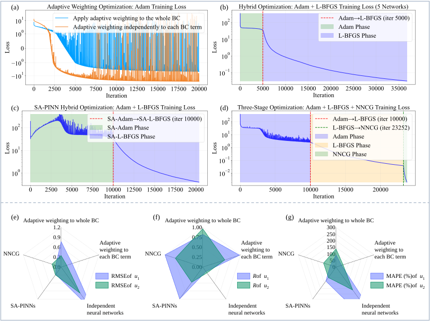

# 物理机器学习智能计算



这里主要整理了我在 PINN 与 DeepONet 方向的一些算例与实验代码，按主题分成了 3 个子目录，便于对比不同方法和训练策略。

## 目录说明

- `PINN优化/`
  - 侧重 PINN 训练策略与网络结构改进。
  - 当前包含：`NNCG`、`注意力机制`、`独立神经网络架构`、`自适应权重` 等实验目录。
- `圆孔算例-强形式PINN_最小势能DEM/`
  - 二维圆孔薄板线弹性问题。
  - 对比强形式 PINN 与基于最小势能的能量方法。
  - 目录内包含可直接运行的 `run.py`、`src/`、`scripts/`、`outputs/`。
- `隧道-溶洞多洞室算子学习DeepONet/`
  - 面向隧道/溶洞场景的应力预测与算子学习实验。
  - 包含不同方法实现（`methods/`）、训练数据（`train_data/`）与结果图（`figures/`）。

## 使用方式

建议进入具体子项目后，按各自目录中的说明运行。典型流程如下：

```bash
pip install -r requirements.txt
python run.py
```

说明：不同子项目的依赖和入口脚本可能略有差异，请以子目录下的 `README.md` 或脚本文件为准。
